# COPUS Analysis for publication
Tony Hui  

# Processing the data


```
## Loading required package: knitr
```


## Cluster ignoring time

### Cluster of all classes

The x-axis labels represent course-instructor-semester pairings:

Course 11, instructor A, semester 1 = 11-A-1

Fractional time was calculated as a mean of all observations


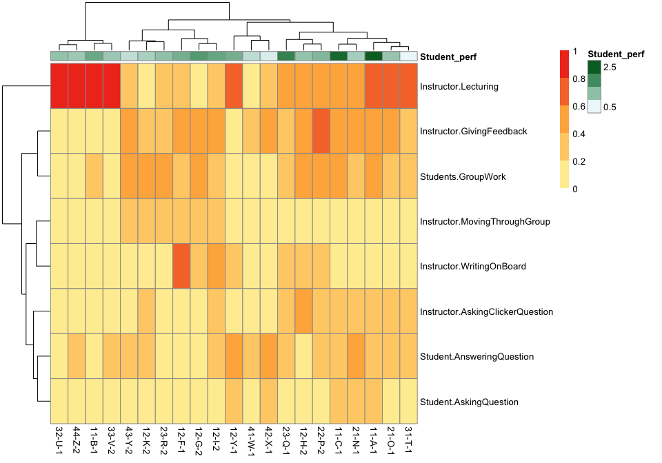

### Cluster of first-year classes


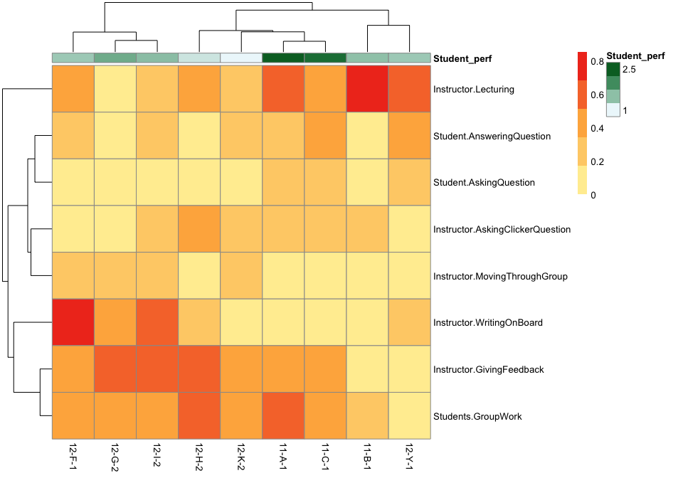

## Cluster, slicing time into 10-minute intervals

### All classes, sliced, clustered


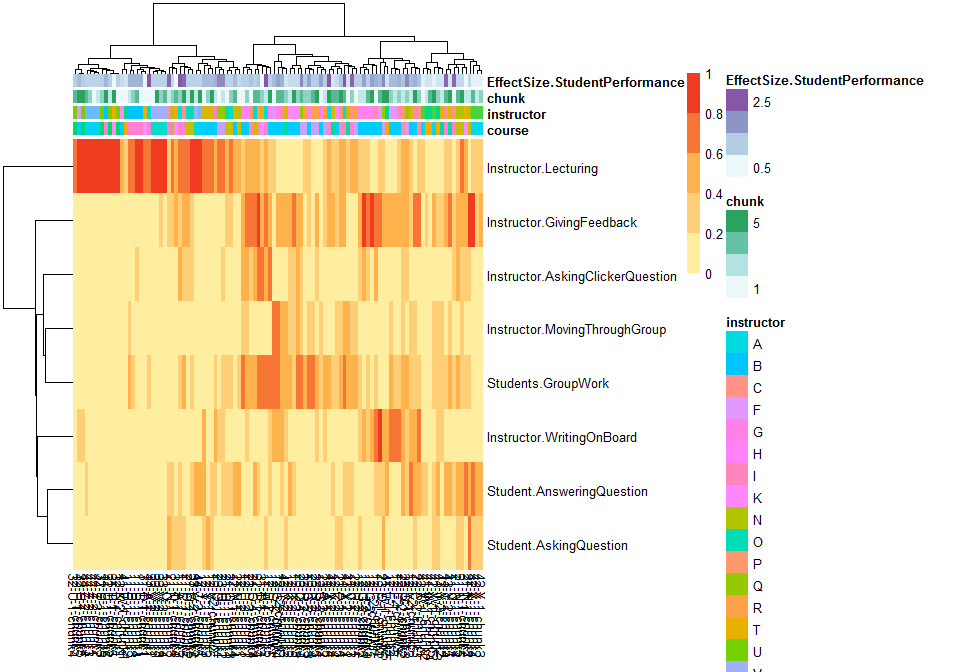

### first year classes, sliced, clustered


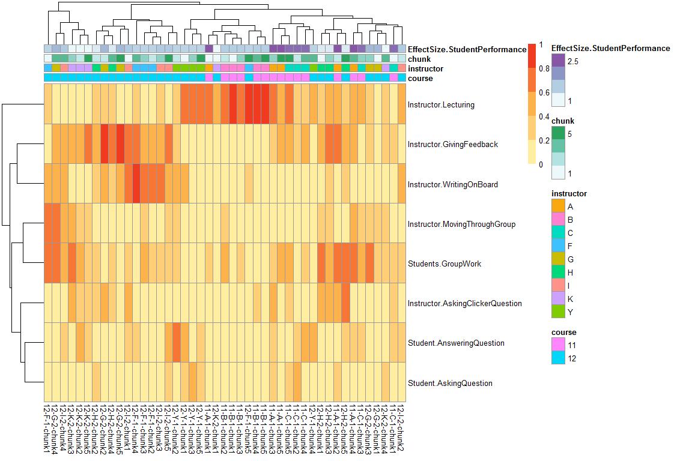

### first year and second year classes, sliced, clustered based on classes X chunk*metric


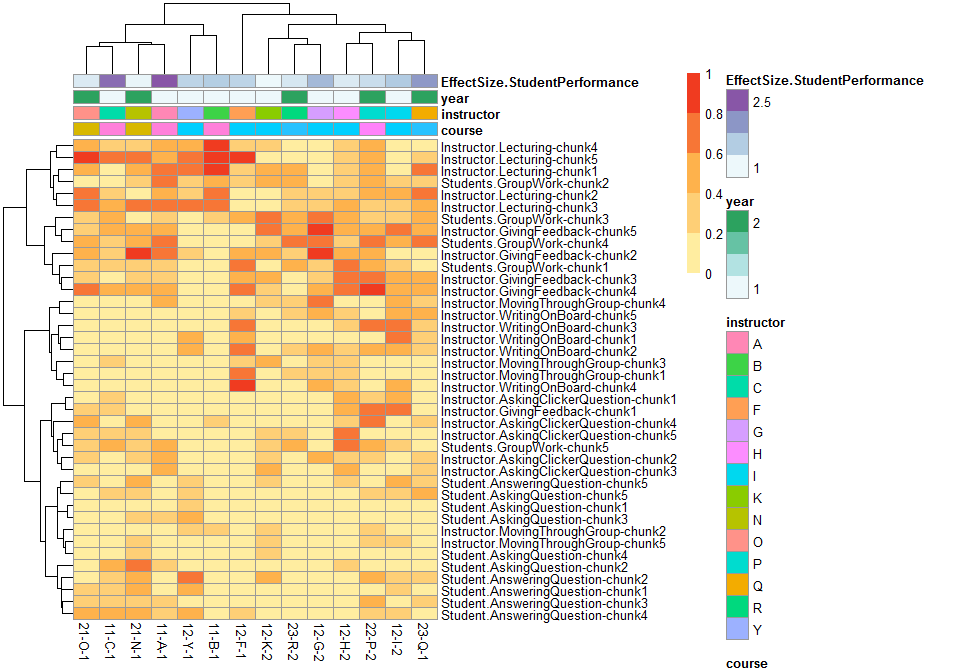

#### No clustering on columns

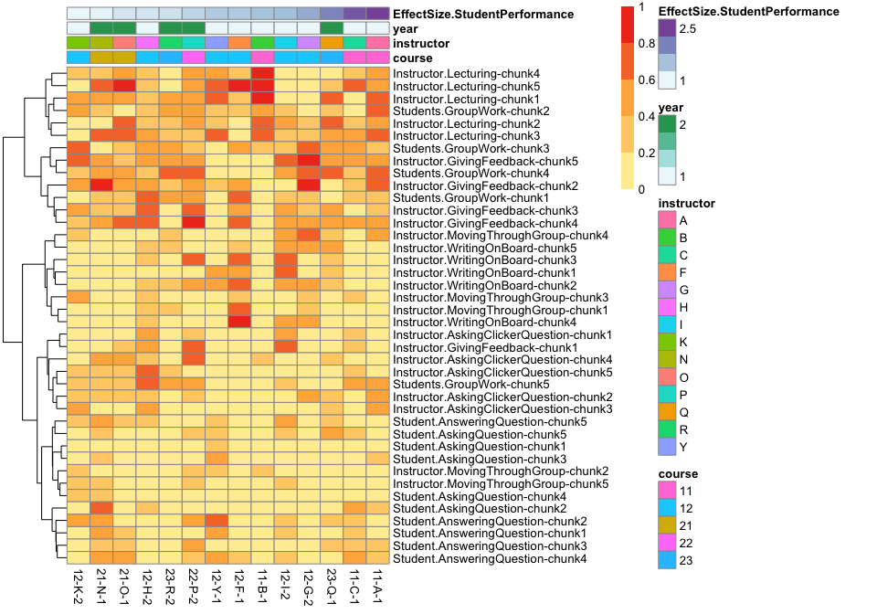

#### No clustering on rows

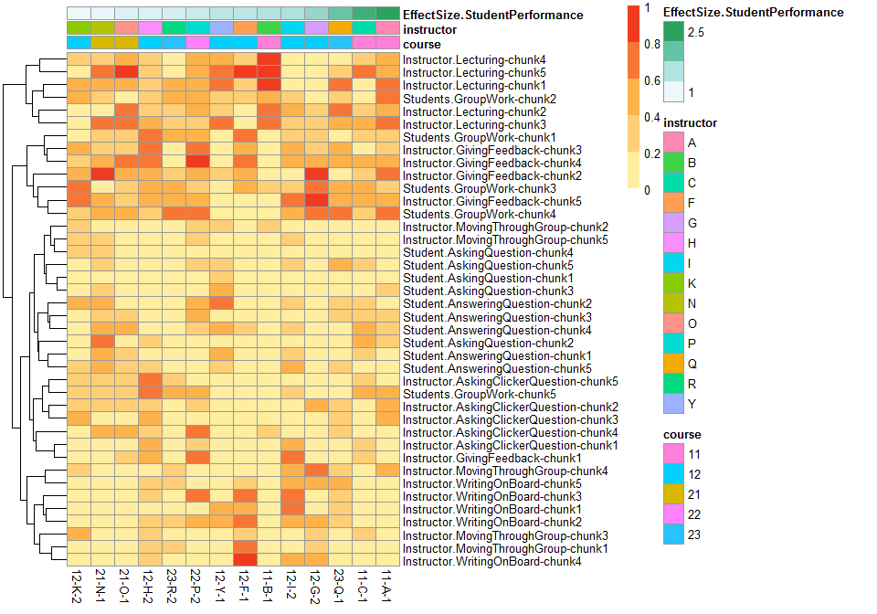

### first year only

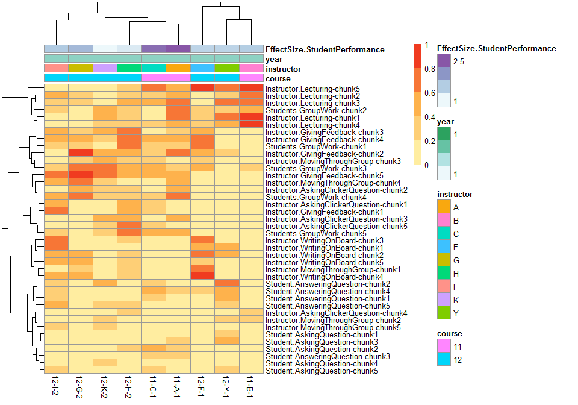

## Rule association mining

From first and second year classes

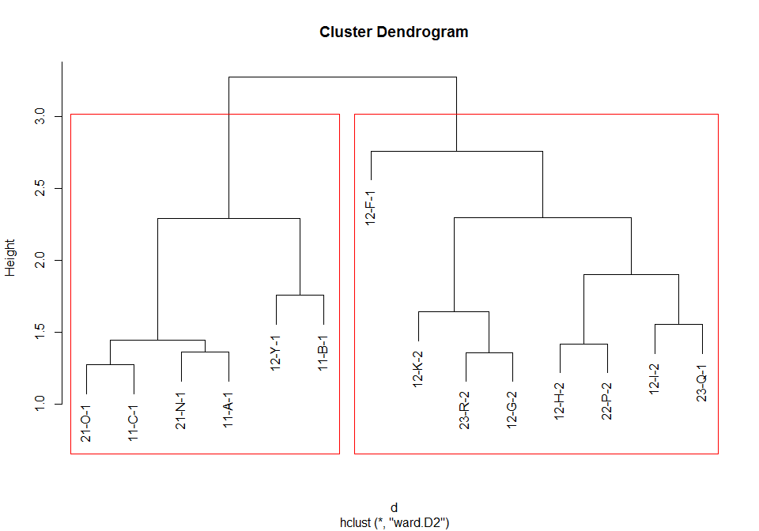

**Cluster one** on the right, **cluster two** on the left


```
## Joining by: "id"
```

See which "features" are significantly different between the two clusters


|measure                              |  pval|   fdr|
|:------------------------------------|-----:|-----:|
|Instructor.Lecturing-chunk3          | 0.000| 0.000|
|Instructor.WritingOnBoard-chunk5     | 0.003| 0.117|
|Instructor.Lecturing-chunk4          | 0.009| 0.342|
|Instructor.Lecturing-chunk5          | 0.009| 0.342|
|Instructor.GivingFeedback-chunk3     | 0.019| 0.684|
|Instructor.WritingOnBoard-chunk3     | 0.022| 0.770|
|Instructor.WritingOnBoard-chunk2     | 0.024| 0.816|
|Instructor.WritingOnBoard-chunk4     | 0.030| 0.990|
|Students.GroupWork-chunk3            | 0.035| 1.000|
|Instructor.MovingThroughGroup-chunk1 | 0.036| 1.000|

Visualize the chunks with pvalue < 0.05

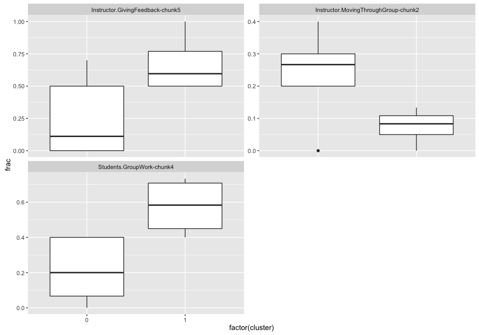

## Heatmap over time for the two clusters

Average the of all classes that fall within cluster 1 or 2 and plot over time.


```
## Joining by: "id"
```

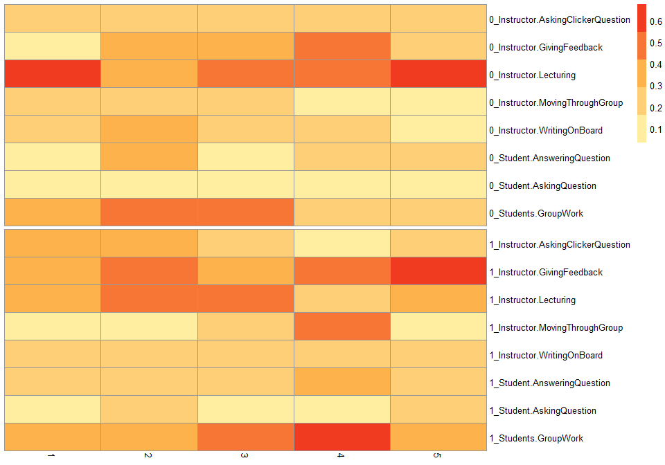

