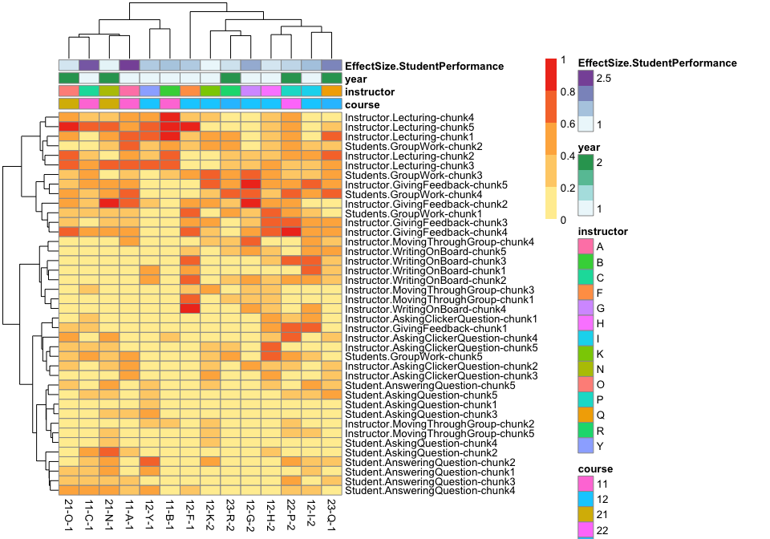
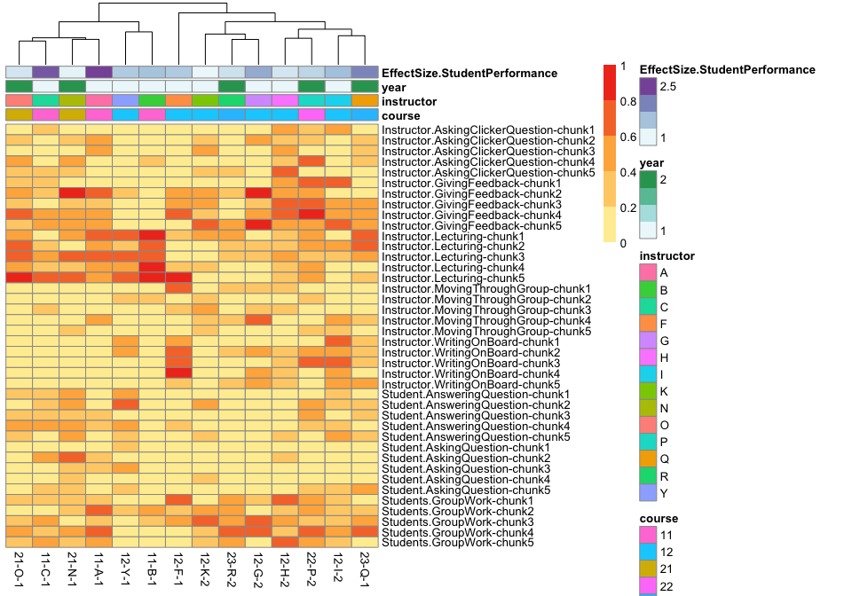
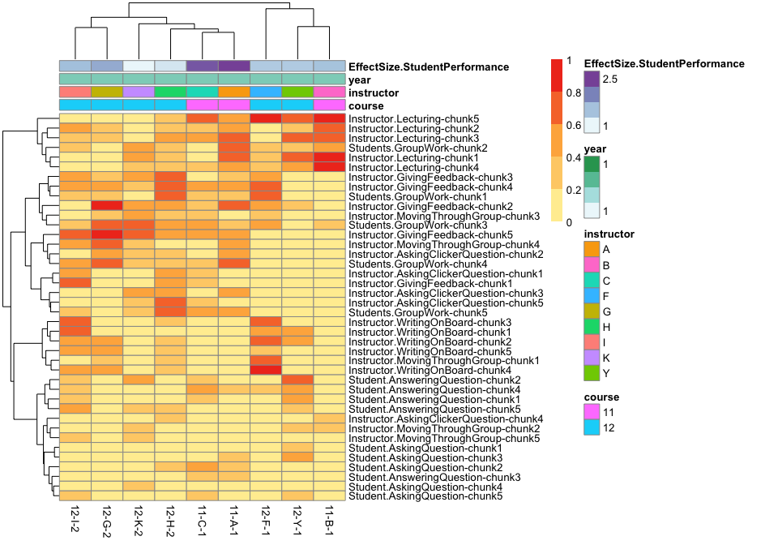
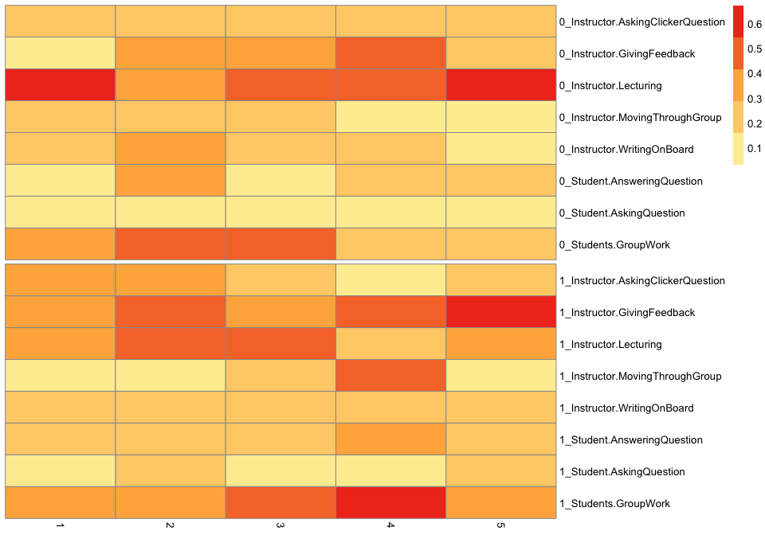

# COPUS Analysis for publication
Tony Hui  

## 1 Processing the data


```
## Loading required package: knitr
```


## 2 Cluster ignoring time

### 2.1 Cluster of all classes

The x-axis labels represent course-instructor-semester pairings:

Course 11, instructor A, semester 1 = 11-A-1

Fractional time was calculated as a mean of all observations


### 2.2 Cluster of first-year classes


## 3 Cluster, slicing time into 10-minute intervals

### 3.1 All classes, sliced, clustered


### 3.2 first year classes, sliced, clustered


## 4 Cluster within classes using different chunks as features

### 4.1 first year and second year classes, sliced, clustered based on classes X chunk*metric




### 4.2 No clustering on columns


### 4.3 No clustering on rows



### 4.4 first year only



## 5 Rule association mining

From first year classes only


```
## Joining by: "id"
```

See which "features" are significantly different between the two clusters


|measure                                 |  pval|  fdr|
|:---------------------------------------|-----:|----:|
|Students.GroupWork-chunk4               | 0.018| 0.72|
|Instructor.GivingFeedback-chunk5        | 0.062| 1.00|
|Instructor.MovingThroughGroup-chunk2    | 0.077| 1.00|
|Instructor.Lecturing-chunk1             | 0.105| 1.00|
|Instructor.MovingThroughGroup-chunk4    | 0.132| 1.00|
|Instructor.AskingClickerQuestion-chunk4 | 0.144| 1.00|

Visualize the chunks with pvalue < 0.1


## Heatmap over time for the two clusters

Average the of all classes that fall within cluster 1 or 2 and plot over time.


```
## Joining by: "id"
```



