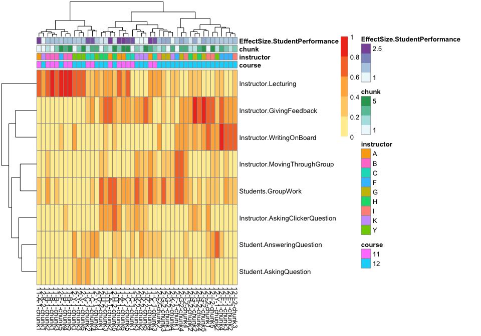

# COPUS Analysis for publication
Tony Hui  

# Processing the data


```r
require(knitr)
```

```
## Loading required package: knitr
```

```r
opts_chunk$set(echo=F, fig.width = 12, fig.height = 8)
```


## Chunking data


## Cluster ignoring time

### Cluster of all classes


### Cluster of first-year classes


## Cluster, slicing time into 10-minute intervals

### All classes, sliced, clustered


### first year classes, sliced, clustered



