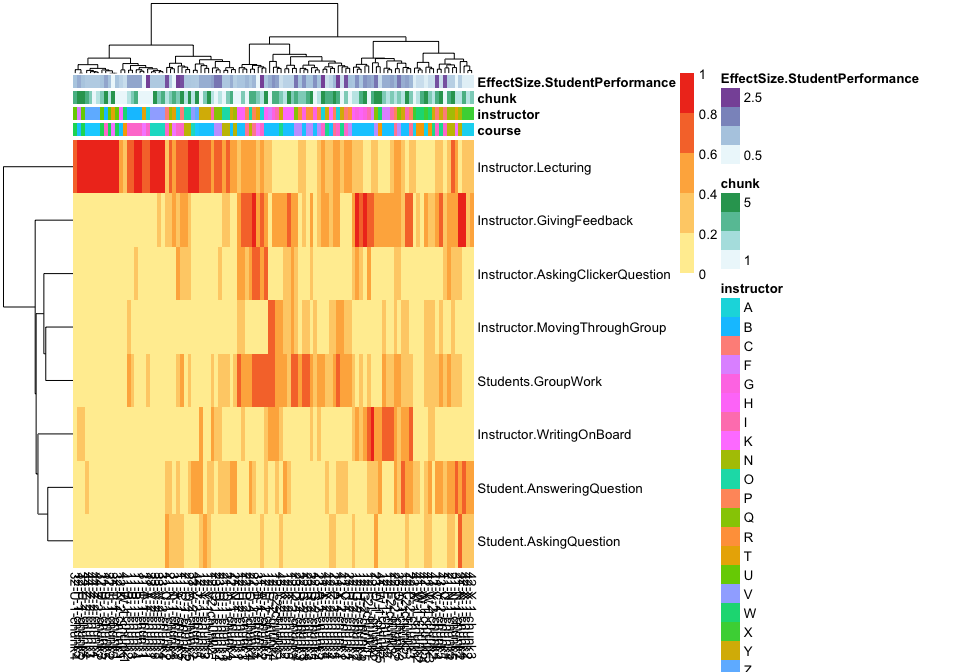

# COPUS Analysis for publication
Tony Hui  

# Processing the data


```r
require(knitr)
```

```
## Loading required package: knitr
```

```r
opts_chunk$set(echo=F, fig.width = 10, fig.height = 7)
cluster_method <- "complete"
```


## Cluster ignoring time

### Cluster of all classes

The x-axis labels represent course-instructor-semester pairings:

Course 11, instructor A, semester 1 = 11-A-1

Fractional time was calculated as a mean of all observations


### Cluster of first-year classes


## Cluster, slicing time into 10-minute intervals

### All classes, sliced, clustered




### first year classes, sliced, clustered


### first year and second year classes, sliced, clustered based on classes X chunk*metric


#### No clustering on columns


#### No clustering on rows


