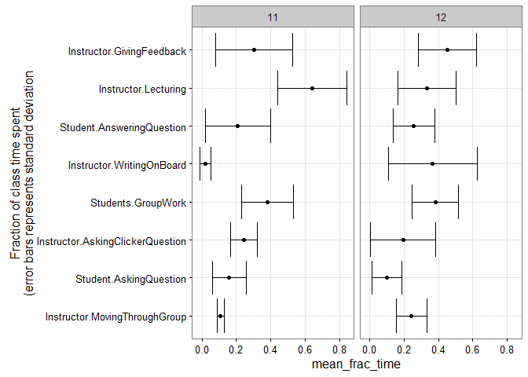

# COPUS Analysis for publication
Tony Hui  

# Processing the data


```r
require(knitr)
```

```
## Loading required package: knitr
```

```r
opts_chunk$set(echo=F)
```


## Sanity check the data


```
## [1] "Number of Columns for all files: 31"
```

Remove classes that are shorter than 43 minutes and longer than 51 minutes


  x   freq
---  -----
 16      1
 17      2
 18      1
 19      3
 20      2
 21      2
 22      4
 23     17
 24     22
 25     13
 27      1
 33      1
 34      3
 35      2
 36      3
 37      3
 38      2
 39      6
 40      2


## Combine data from all classes/observations into one file


### Filter out unwanted variables

Notes from Megan: The 8 variables used in the Lund et al paper (and their short form codes from Lund’s Table 4) are:

* Student-AnsweringQuestion (AnQ-S)
* Student-AskingQuestion (SQ)
* Instructor-AskingClickerQuestion (CQ)
* Instructor-GivingFeedback (FUp)
* Instructor-Lecturing (Lec)
* Instructor-WritingOnBoard (RtW)
* Instructor-MovingThroughGroup (MG)
* Students-GroupWork (GW) 
    + this is an amalgam of the three student groupwork codes, which we need to process.  It is considered checked off (“1”) if any of the three student groupwork raw codes occurs in the given interval. (Students-ClickerQuestionInGroups. Students-Worksheet, Students-OtherGroupwork)


| time|course |instructor |semester |observation |year | Student.AnsweringQuestion| Student.AskingQuestion| Instructor.AskingClickerQuestion| Instructor.GivingFeedback| Instructor.Lecturing| Instructor.WritingOnBoard| Instructor.MovingThroughGroup| Students.GroupWork|
|----:|:------|:----------|:--------|:-----------|:----|-------------------------:|----------------------:|--------------------------------:|-------------------------:|--------------------:|-------------------------:|-----------------------------:|------------------:|
|    2|11     |A          |1        |1           |1    |                         0|                      0|                                1|                         1|                    0|                         0|                             0|                  1|
|    4|11     |A          |1        |1           |1    |                         0|                      0|                                0|                         0|                    0|                         0|                             0|                  1|
|    6|11     |A          |1        |1           |1    |                         0|                      0|                                1|                         1|                    1|                         0|                             0|                  1|
|    8|11     |A          |1        |1           |1    |                         0|                      0|                                1|                         1|                    0|                         0|                             0|                  1|
|   10|11     |A          |1        |1           |1    |                         0|                      1|                                0|                         1|                    0|                         0|                             0|                  0|
|   12|11     |A          |1        |1           |1    |                         0|                      0|                                0|                         1|                    0|                         0|                             0|                  1|

## Process the class performance data


|course |instructor |semester | EffectSize.StudentPerformance| SE.EffectSize.StudentPerformance|ClassSize     |CopusProfile                           |CopusStyle       | TeachingPracticesInventoryScore| NormalizedChange.StudentPerformance| SE.NormalizedChange.StudentPerformance|
|:------|:----------|:--------|-----------------------------:|--------------------------------:|:-------------|:--------------------------------------|:----------------|-------------------------------:|-----------------------------------:|--------------------------------------:|
|11     |A          |1        |                          2.91|                             0.17|More than 200 |Student-Centered Peer Instruction      |Collaborative    |                              20|                            74.09648|                               1.853726|
|11     |B          |1        |                          1.51|                             0.16|More than 200 |Limited Peer Instruction (with slides) |Peer Instruction |                              20|                            56.49132|                               3.643105|
|11     |C          |1        |                          2.65|                             0.15|More than 200 |Student-Centered Peer Instruction      |Collaborative    |                              20|                            70.73516|                               2.167993|
|11     |D          |1        |                          2.75|                             0.16|More than 200 |Student-Centered Peer Instruction      |Collaborative    |                              20|                            69.68558|                               1.855365|
|12     |E          |2        |                          1.36|                             0.21|More than 200 |Teacher-Centered Peer Instruction      |Peer Instruction |                              16|                            29.07547|                               3.354000|
|12     |H          |2        |                          1.05|                             0.18|More than 200 |Student-Centered Peer Instruction      |Collaborative    |                              17|                            22.28033|                               3.297568|

### Merge performance data with the classes data


```
## Joining by: c("course", "instructor", "semester")
```

# Basic exploratory analysis

## Fractional amount of time spent on each category overall per class


## Fractional amount of time spent on each category overall per class year


## Number of different instructor-semester pairings per per course


## Fractional amount of time spent on each category for course `12`, `21`, and `11`, further granuarized by instructor

The labels in each box represents the course id


## Time spent on lecture vs student growth

All courses - each dot is one course (separated by year level)


Looks like there's a positive correlation with lecture time and student performance in first year classes, and a negative correlation in second year classes

# Question 1: Which activities (individually) has an effect on student performance?

## Plot the variation of each measure for a single course and compare across instructors-semester pairings

It really doesn't make sense to look across courses since different courses have different content = different methods of learning - scientific method: only vary one variable at a time.

### Plot the variation of each measure for course 12 between instructors-semester pairings



## Plot correlation between the top activities with the highest variations


|course |measure                          | mean_frac_time| sd_frac_time|
|:------|:--------------------------------|--------------:|------------:|
|11     |Instructor.GivingFeedback        |      0.3695967|    0.1952960|
|11     |Instructor.Lecturing             |      0.6452251|    0.1506574|
|11     |Students.GroupWork               |      0.4838322|    0.1345030|
|12     |Instructor.WritingOnBoard        |      0.3272549|    0.2142247|
|12     |Instructor.GivingFeedback        |      0.4915614|    0.1548330|
|12     |Instructor.AskingClickerQuestion |      0.1565821|    0.1544680|
|21     |Instructor.Lecturing             |      0.5679053|    0.1919070|
|21     |Instructor.GivingFeedback        |      0.3833762|    0.1373068|
|21     |Student.AnsweringQuestion        |      0.3404814|    0.1301166|

```
## Joining by: c("course", "measure")
```

```
## Joining by: c("course", "instructor", "semester")
```


# Question 2: Which activities (individually) explains the largest variability in student performance across all courses?

### Multiple linear regression

#### Transform data for regression modelling


```
## Joining by: c("course", "instructor", "semester")
```


|course |instructor |semester | Instructor.AskingClickerQuestion| Instructor.GivingFeedback| Instructor.Lecturing| Instructor.MovingThroughGroup| Instructor.WritingOnBoard| Student.AnsweringQuestion| Student.AskingQuestion| Students.GroupWork| EffectSize.StudentPerformance|
|:------|:----------|:--------|--------------------------------:|-------------------------:|--------------------:|-----------------------------:|-------------------------:|-------------------------:|----------------------:|------------------:|-----------------------------:|
|11     |A          |1        |                        0.3191489|                 0.4893617|            0.5425532|                     0.1595745|                 0.0425532|                 0.2234043|              0.2021277|          0.5531915|                          2.91|
|11     |B          |1        |                        0.3046875|                 0.1015625|            0.8671875|                     0.0625000|                 0.0000000|                 0.0390625|              0.0937500|          0.3046875|                          1.51|
|11     |C          |1        |                        0.3508772|                 0.3508772|            0.5614035|                     0.1578947|                 0.0000000|                 0.2631579|              0.1578947|          0.6140351|                          2.65|
|11     |D          |1        |                        0.3902439|                 0.5365854|            0.6097561|                     0.1707317|                 0.0243902|                 0.2682927|              0.2926829|          0.4634146|                          2.75|
|12     |E          |2        |                        0.0759494|                 0.5822785|            0.3291139|                     0.2278481|                 0.3670886|                 0.3037975|              0.1645570|          0.2911392|                          1.36|
|12     |F          |1        |                        0.0000000|                 0.4347826|            0.3913043|                     0.3043478|                 0.7391304|                 0.1739130|              0.0000000|          0.3913043|                          1.41|

#### Predicting student performance as a function of all our variables


```
## 
## Call:
## glm(formula = as.formula(paste("EffectSize.StudentPerformance ~ ", 
##     paste(predicting_variables, collapse = "+"))), data = summary_of_fract_time_spent %>% 
##     filter(course %in% course_of_interest))
## 
## Deviance Residuals: 
##      Min        1Q    Median        3Q       Max  
## -0.83920  -0.26548  -0.03268   0.25759   0.69183  
## 
## Coefficients:
##                                  Estimate Std. Error t value Pr(>|t|)  
## (Intercept)                        0.2892     1.7392   0.166   0.8716  
## Instructor.AskingClickerQuestion  -3.0389     1.9596  -1.551   0.1554  
## Instructor.GivingFeedback         -0.9936     1.4141  -0.703   0.5000  
## Instructor.Lecturing               0.1386     1.6344   0.085   0.9343  
## Instructor.MovingThroughGroup     -1.3240     3.7018  -0.358   0.7288  
## Instructor.WritingOnBoard          0.4811     1.0130   0.475   0.6461  
## Student.AnsweringQuestion         -3.5912     2.0192  -1.779   0.1090  
## Student.AskingQuestion             5.5225     2.6839   2.058   0.0697 .
## Students.GroupWork                 6.3983     2.0347   3.145   0.0118 *
## ---
## Signif. codes:  0 '***' 0.001 '**' 0.01 '*' 0.05 '.' 0.1 ' ' 1
## 
## (Dispersion parameter for gaussian family taken to be 0.3048466)
## 
##     Null deviance: 8.7000  on 17  degrees of freedom
## Residual deviance: 2.7436  on  9  degrees of freedom
## AIC: 37.222
## 
## Number of Fisher Scoring iterations: 2
```

# Question 3 - which classes are arranged such that they have similar amounts of time spent on each activity?

The more "red" the color, the more time that activity is spent on class


## What about across all courses?


